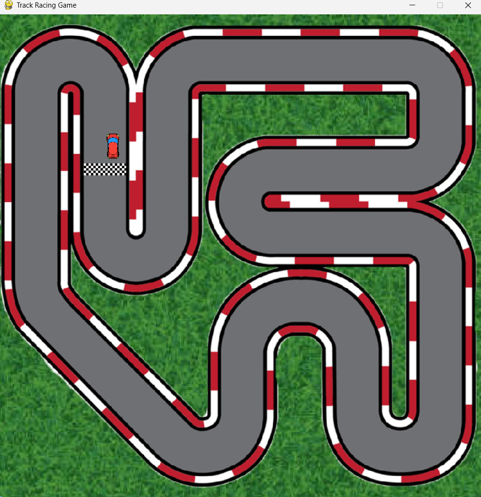

## 🏎️ Track Racing Game (Pygame)

A simple 2D top-down racing game built with **Python** and **Pygame**, where the car moves and rotates on a static track. This version features car controls, collision with track borders, and finish line detection.

---

### 🎮 Current Features

* 🔁 Car rotation and forward/backward movement
* ⛽ Acceleration and friction logic
* 🧱 Track boundary collision (bounce back)
* 🏁 Finish line detection and car reset
* 🔄 Image scaling and rotation utilities

---

### 🧩 Project Structure

```
Track_Racing/
├── main.py            # Main game loop and car control logic
├── utils.py           # Image scaling and rotation functions
├── Images/
│   └── imgs/          # All game images (track, cars, grass, etc.)
│       ├── track.png
│       ├── track-border.png
│       ├── red-car.png
│       ├── finish.png
│       └── grass.jpg
```

---

### 📷 Screenshots




### 💻 How to Run

1. Make sure you have Python and Pygame installed:

```bash
pip install pygame
```

2. Run the game:

```bash
python main.py
```

---

### 🎮 Controls

| Key                 | Action                |
| ------------------- | --------------------- |
| W                   | Accelerate forward    |
| S                   | Move backward / brake |
| A                   | Rotate left           |
| D                   | Rotate right          |
| ESC or Window Close | Quit the game         |

---

### 📌 Upcoming Features

* [ ] Lap counter and timer
* [ ] AI or second car
* [ ] Sound effects and background music
* [ ] Scoreboard or laps completed
* [ ] Main menu and restart option


